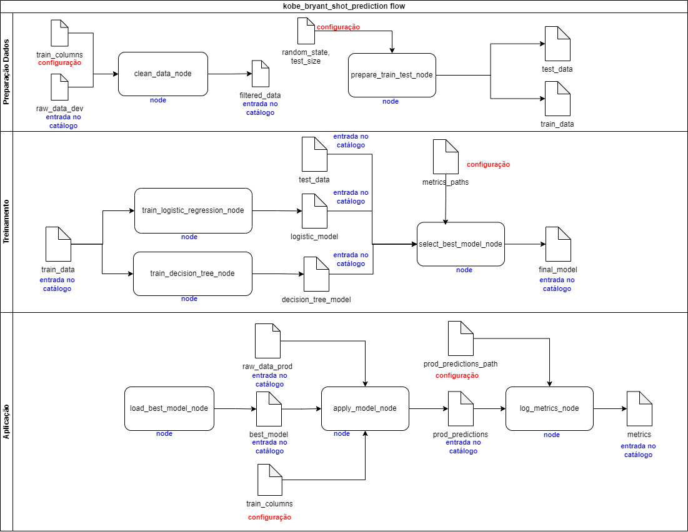
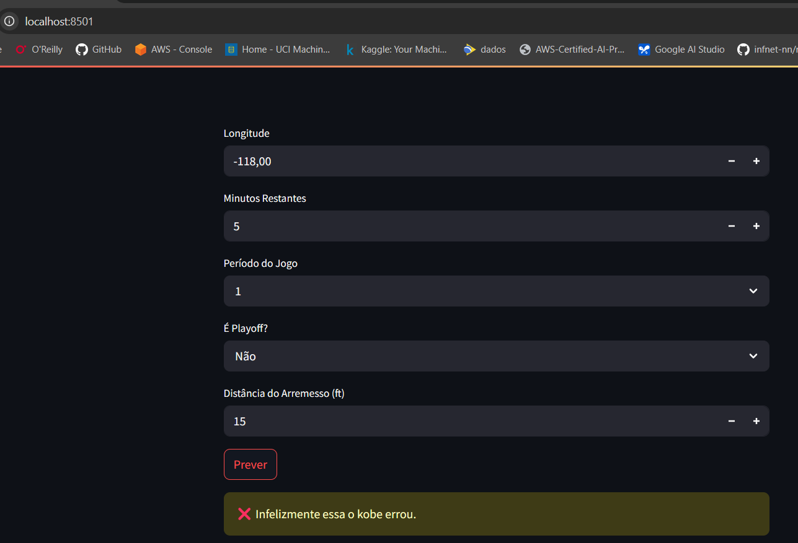
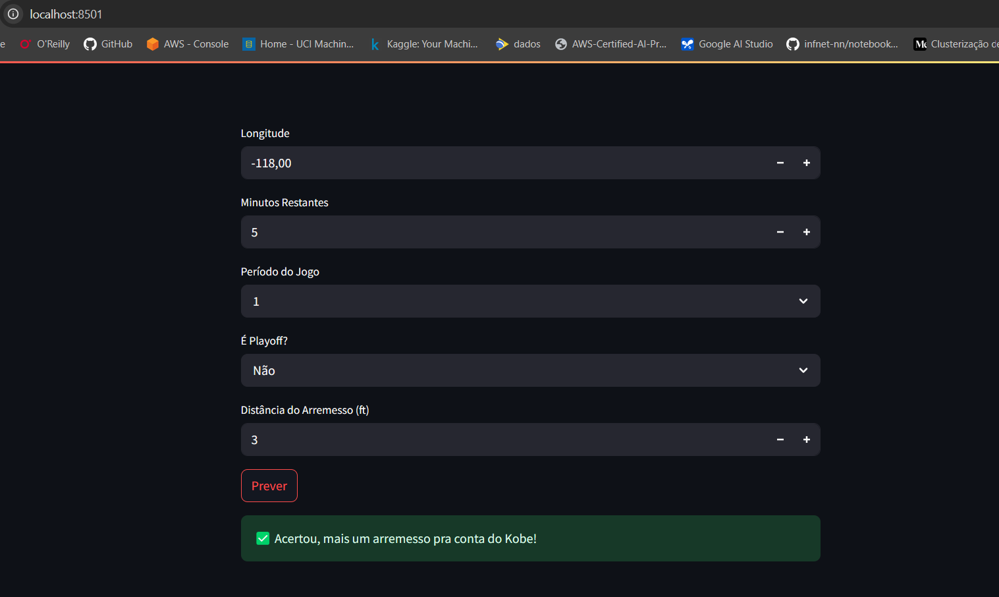

# 🏀 Modelo de Classificação - Dataset Kobe Bryant

Este projeto utiliza ferramentas modernas de machine learning para construir um pipeline completo com foco em classificação de jogadas do Kobe Bryant. O objetivo é avaliar a performance dos modelos, sua aderência à base de produção e estratégias de monitoramento e retreinamento.

---

[Repositório do projeto](https://github.com/ronaldobresende/kobe-bryant-shot-prediction)

## 🚀 Tecnologias Utilizadas

- **Python**
- **Scikit-Learn**: modelagem tradicional
- **PyCaret**: automação do pipeline de ML
- **MLflow**: rastreamento de experimentos e registro de modelos
- **Streamlit**: monitoramento operacional

---

📊 Diagrama dos fluxos das pipelines



---

### 📦 2. Quais artefatos serão criados ao longo do projeto? Quais suas composições?

| Artefato                              | Descrição |
|---------------------------------------|-----------|
| `dataset_kobe_{dev,prod}.parquet`     | Dados brutos de desenvolvimento e produção. |
| `data_filtered.parquet`               | Dados tratados sem nulos. |
| `base_train.parquet`, `base_test.parquet` | Dados separados para treino e teste. |
| `decision_tree_model.pkl`             | Modelo treinado com árvore de decisão. |
| `logistic_model.pkl`                  | Modelo treinado com regressão logística. |
| `final_model.pkl`                     | Modelo avaliado como o melhor entre os 2 acima. |
| `prod_predictions.parquet`            | Previsões feitas na base de produção. |
| `best_model_metrics.json`             | Métricas do melhor modelo escolhido. |
| `decision_tree_model_metrics.json`    | Métricas do modelo de árvore de decisão. |
| `logistic_model_metrics.json`         | Métricas do modelo de regressão logística. |

## 🧠 Respostas às Perguntas do Projeto

### ✅ 1. Como as ferramentas Streamlit, MLflow, PyCaret e Scikit-Learn auxiliam na construção dos pipelines

- **Rastreamento de experimentos (MLflow):**  
  Toda execução dos pipelines registra os parâmetros, métricas, modelos treinados e artefatos. Isso facilita comparar diferentes abordagens e manter controle de versões.

- **Funções de treinamento (Scikit-Learn e PyCaret):**  
  O Scikit-Learn fornece os algoritmos de regressão e classificação usados no projeto. O PyCaret simplifica o setup, o pré-processamento e a comparação entre modelos com poucas linhas de código.

- **Monitoramento da saúde do modelo (MLflow + Streamlit):**  
  O MLflow registra o desempenho do modelo em produção, e o Streamlit será usado para montar um front-end simples, para inferência do modelo.

- **Atualização de modelo:**  
  O pipeline está preparado para ser reexecutado com novos dados, já que estão parametrizados. Isso permite o retreinamento do modelo com base em mudanças observadas na produção (ex: mudança no comportamento dos arremessos).

- **Provisionamento (Deployment):**  
  O modelo final é registrado no MLflow Model Registry, podendo ser servido via `mlflow models serve` como uma API REST local. Isso facilita integrar o modelo com outras aplicações ou sistemas.

---

### 📊 3. Preparação Dados

### Após o pré-processamento, a base final utilizada ficou com 20.285 linhas e 7 colunas
As dimensões após o pré-processamento estão registradas e podem ser vistas no MLflow:
- `rows_after`: 20285.
- `columns_after`: 7
Esses valores também podem ser verificados no arquivo `data_filtered.parquet`
---

### Como a escolha de treino e teste afetam o modelo final:

- Uma divisão bem feita evita que o modelo "vaze" conhecimento dos dados de teste.
- A **estratificação** garante a mesma proporção da variável alvo em ambas as bases.
---

### Estratégias para minimizar viés:

- **Estratificação**, como citado anteriormente
- Uso de `random_state` para reprodutibilidade.
- Uso de técnicas como `SMOTE`, `undersampling`, ou validação cruzada, caso haja desbalanceamento do target.

---

### 🏆 4. Treinamento

### Modelo escolhido para finalização

**Modelo selecionado:** Regressão Logística

**Métricas:**
- Log Loss (Regressão Logística): 0.6788  
- Log Loss (Decisão): 14.4320  
- F1 Score (Regressão Logística): 0.5139  
- F1 Score (Decisão): 0.5400  

Apesar da árvore de decisão ter um F1 score um pouco melhor, o log loss dela é muito alto, o que mostra que ela erra com muita confiança. Já a regressão logística tem um log loss bem mais baixo, o que indica que ela está mais calibrada nas probabilidades que gera. Como nesse caso a ideia é ter um modelo que erre menos nas previsões de probabilidade, mesmo que com leve perda no F1, a regressão logística acaba sendo a opção mais segura para colocar em produção.

---

### 🚦 6. PipelineAplicacao

### Aderência do modelo à base de produção

**O desempenho do modelo na base de produção mostrou que ele não é aderente à nova base.** 

**Métricas observadas:**
- `log_loss_prod`: 4.4235 (muito alto)
- `f1_score_prod`: 0.0 (não acertou nenhuma classe positiva)
- Proporção de valores nulos em `shot_made_flag`: 15.78%

**Justificativa:**
O modelo não conseguiu prever nenhum acerto da classe positiva (F1 = 0.0), e errou com alta confiança (log loss elevado). Isso sugere que a base de produção possui características diferentes da base usada no treino. Além disso, quase 16% da variável alvo está ausente, o que pode comprometer a avaliação das métricas.


---

### 🧩 7. Monitoramento da saúde do modelo

Quando a variável target está disponível em produção, a saúde do modelo pode ser monitorada diretamente através de métricas como `log_loss`, `F1-score` e acurácia. Essas métricas são registradas a cada execução com o MLflow, permitindo comparações com versões anteriores do modelo.

No cenário sem variável resposta, o monitoramento deve focar em possíveis mudanças nos dados de entrada. Técnicas como detecção de *data drift*, *concept drift* e *feature drift* podem ser aplicadas, usando testes estatísticos (ex: Kolmogorov-Smirnov) ou análise da distribuição das predições do modelo ao longo do tempo. Isso ajuda a identificar degradação de performance antes mesmo que erros ocorram.

### 🔄 8 . Estratégias de retreinamento: Reativa vs Preditiva

**Estratégia reativa:**  
O modelo é retreinado somente após uma queda observada nas métricas de performance (ex: F1-score, log loss). Ou seja, o gatilho do retreinamento é o desempenho ruim detectado no monitoramento. Essa abordagem é simples e direta, mas pode deixar o modelo degradado por um tempo até que o problema seja percebido.

**Estratégia preditiva:**  
O modelo é retreinado de forma antecipada, com base em sinais indiretos como mudanças na distribuição dos dados (data drift, concept drift), mesmo sem queda imediata na performance. Essa abordagem depende de um monitoramento mais robusto e ajuda a prevenir falhas antes que elas impactem os resultados.

Ambas as estratégias podem ser combinadas em um fluxo de monitoramento contínuo: detectar sinais de mudança, avaliar impacto nas métricas, e decidir se o modelo deve ser atualizado com dados mais recentes.


## 📊 9. Streamlit - Inferência do modelo

O script `app.py` oferece uma interface interativa para:

- Prever se um arremesso do Kobe Bryant foi convertido ou não, com base em variáveis como localização, período do jogo e distância do arremesso.
- Visualizar os resultados da previsão com exemplos ilustrativos.

### Exemplos de saída:

- **Arremesso não convertido**:
  

- **Arremesso convertido**:
  

Para rodar localmente:

```bash
streamlit run app.py
```

---

## 🧪 Como executar

1. Instale o kedro:

```bash
pip install kedro

```

2. Instale os pacotes:

```bash
pip install -r requirements.txt

```

3. Inicie o MLflow Tracking:

```bash
mlflow ui
```

4. Execute o pipeline completo:

```bash
kedro run
```

4. Servir o modelo:

```bash
mlflow models serve  -m models:/kobe_model/1 --env-manager=local  --port 5001
```

5. Inferência no streamlit:

```bash
streamlit run app.py
```

---


## 👨‍💻 Autor

Projeto acadêmico para fins de estudo de pipelines e monitoramento de modelos com MLflow e Streamlit.  
Desenvolvido por Ronaldo Barbosa Resende.
[GitHub Repository](https://github.com/ronaldobresende/kobe-bryant-shot-prediction)

---


